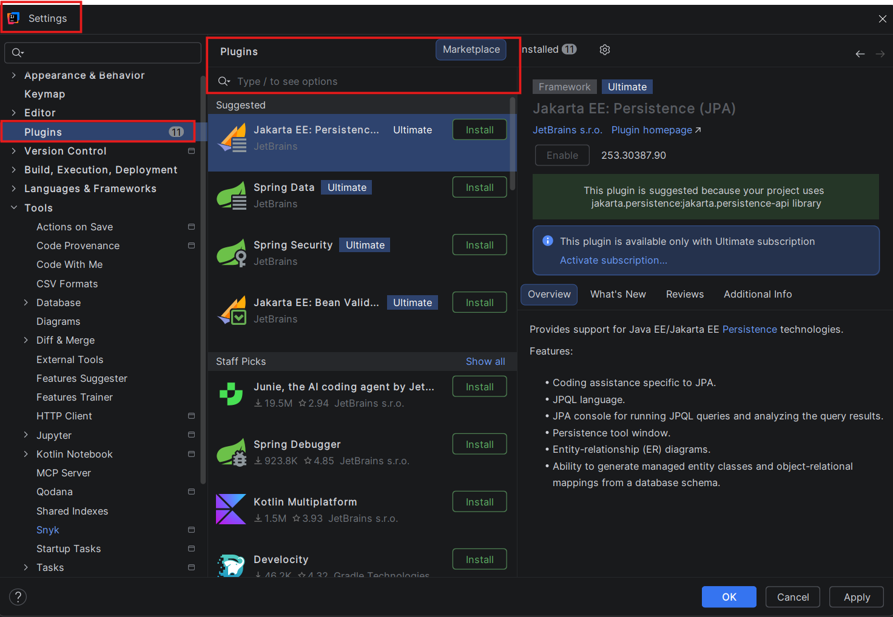
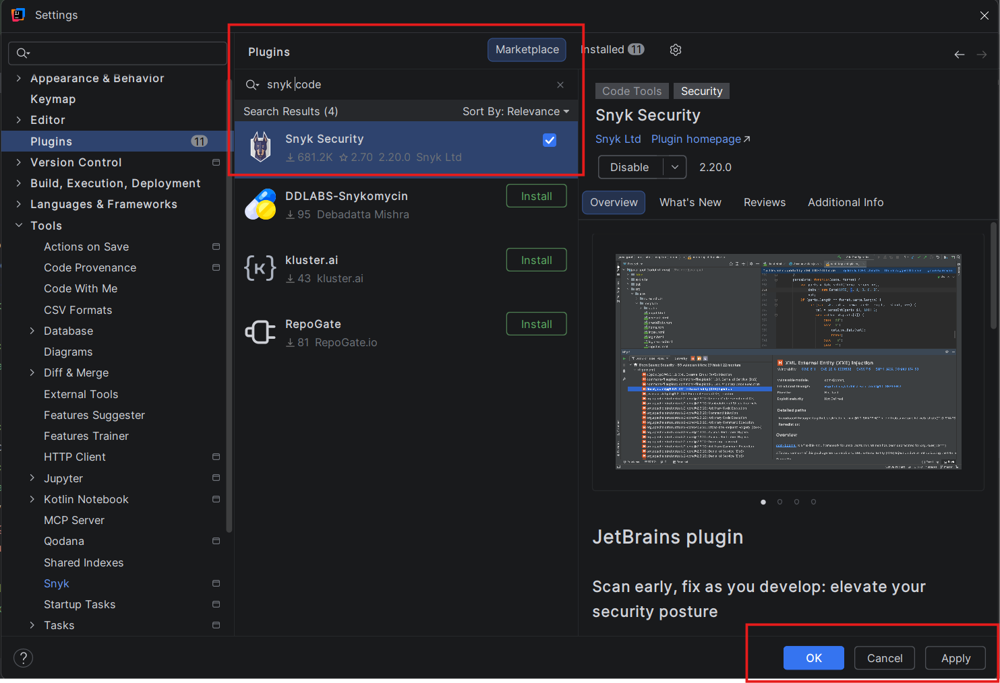
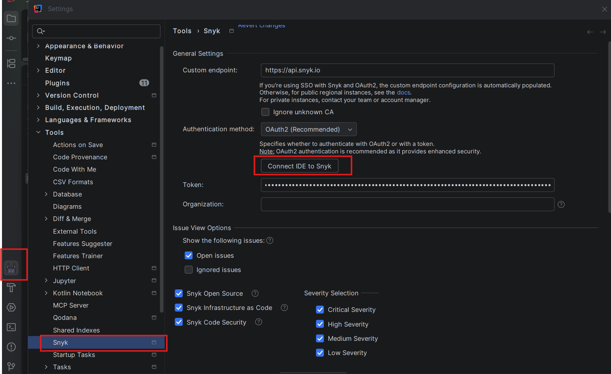
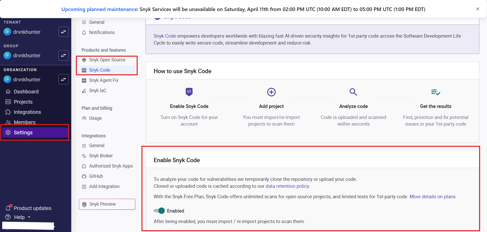
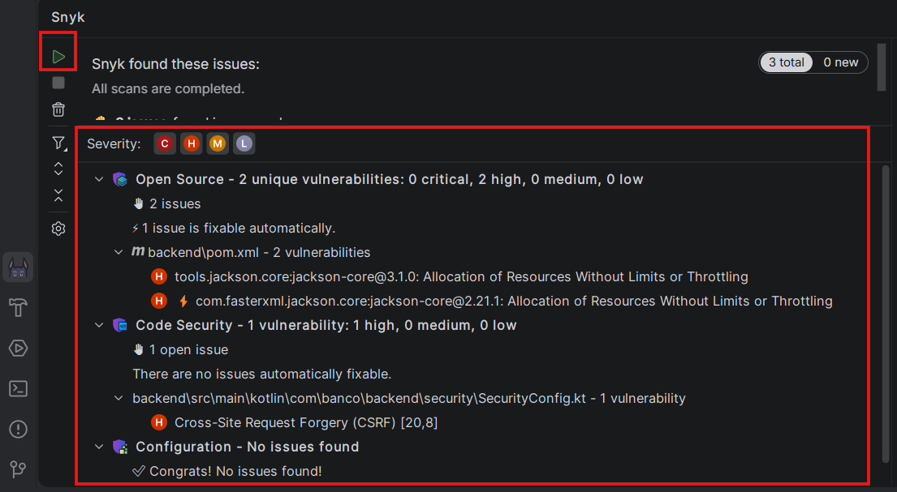

# 🔐 Guía de Instalación — Snyk Code (SAST)


Guía paso a paso para instalar y configurar **Snyk Code** como herramienta SAST (**Static Application Security Testing**) en IntelliJ IDEA y Visual Studio Code / Cursor.

---

## 📋 Tabla de contenidos

- [¿Qué es Snyk Code?](#-qué-es-snyk-code)
- [Requisitos previos](#-requisitos-previos)
- [Instalación en IntelliJ IDEA](#-instalación-en-intellij-idea)
- [Instalación en Visual Studio Code / Cursor](#-instalación-en-visual-studio-code--cursor)
- [Primer escaneo](#-primer-escaneo)
- [Interpretación de resultados](#-interpretación-de-resultados)
- [Severidades en Snyk](#-severidades-en-snyk)

---

## 🔍 ¿Qué es Snyk Code?

**Snyk Code** es una herramienta de análisis estático de seguridad (SAST) que escanea el código fuente de tu proyecto en busca de vulnerabilidades **sin necesidad de ejecutar la aplicación**.

A diferencia de otras herramientas, Snyk Code:

- Analiza el flujo de datos entre funciones para detectar vulnerabilidades reales
- Integra el escaneo directamente en el IDE — resultados en tiempo real mientras escribes
- Cubre múltiples lenguajes: Kotlin, Java, Python, JavaScript, Dart, entre otros
- Clasifica los hallazgos por severidad: **Critical**, **High**, **Medium**, **Low**
- Mapea cada vulnerabilidad a su CWE y OWASP correspondiente

---

## ✅ Requisitos previos

Antes de instalar el plugin necesitas:

1. **Cuenta Snyk** — regístrate gratis en [snyk.io](https://snyk.io)
   > El plan gratuito incluye escaneo SAST ilimitado en proyectos personales.

2. **Git instalado** — Snyk lo usa para identificar el proyecto
   ```bash
   git --version
   ```

3. **IDE compatible**
   - IntelliJ IDEA 2021.1 o superior (Community o Ultimate)
   - Visual Studio Code 1.60 o superior / Cursor

---

## 🧠 Instalación en IntelliJ IDEA

### Paso 1 — Abrir el Marketplace de plugins

1. Abre IntelliJ IDEA
2. Ve a **File → Settings** (Windows/Linux) o **IntelliJ IDEA → Preferences** (macOS)
3. En el panel izquierdo selecciona **Plugins**
4. Haz clic en la pestaña **Marketplace**



---

### Paso 2 — Buscar e instalar Snyk

1. En la barra de búsqueda escribe `Snyk`
2. Selecciona el plugin **Snyk Security** (publicado por Snyk Ltd.)
3. Haz clic en **Install**
4. Acepta los términos si se solicitan
5. Haz clic en **Restart IDE** cuando finalice la instalación



---

### Paso 3 — Autenticarse con Snyk

1. Una vez reiniciado el IDE, aparecerá el panel de **Snyk** en la barra lateral izquierda
2. Haz clic en el ícono de Snyk 🐝
3. Selecciona **Connect IDE to Snyk**
4. Se abrirá el navegador para autenticarte con tu cuenta de Snyk
5. Inicia sesión con Google, GitHub o correo/contraseña
6. Autoriza el acceso al IDE cuando el navegador lo solicite
7. Regresa al IDE — deberías ver el mensaje **"Authenticated"**



---

### Paso 4 — Configurar el escaneo

1. En el panel de Snyk haz clic en el ícono de ⚙️ **Settings**
2. Asegúrate de que las siguientes opciones estén activas:
   - ✅ **Snyk Code** (análisis SAST del código propio)
   - ✅ **Snyk Open Source** (análisis de dependencias)
3. Haz clic en **Apply**



---

### Paso 5 — Ejecutar el primer escaneo

1. Abre tu proyecto en IntelliJ
2. En el panel de Snyk haz clic en **▶ Run Scan**
3. Espera a que el escaneo finalice (puede tardar 30–60 segundos dependiendo del tamaño del proyecto)
4. Los resultados aparecerán clasificados por severidad en el panel



---

## 💻 Instalación en Visual Studio Code / Cursor

### Paso 1 — Abrir el panel de extensiones

1. Abre VS Code o Cursor
2. Haz clic en el ícono de **Extensiones** en la barra lateral izquierda (o presiona `Ctrl+Shift+X`)


---

### Paso 2 — Buscar e instalar Snyk

1. En la barra de búsqueda escribe `Snyk Security`
2. Selecciona la extensión **Snyk Security** (publicada por Snyk)
3. Haz clic en **Install**
4. Espera a que finalice la instalación — no requiere reinicio


---

### Paso 3 — Autenticarse con Snyk

1. Aparecerá el ícono de Snyk 🐝 en la barra lateral izquierda
2. Haz clic en él para abrir el panel
3. Selecciona **Connect VS Code to Snyk**
4. Se abrirá el navegador para autenticarte
5. Inicia sesión con tu cuenta de Snyk
6. Autoriza el acceso y regresa al IDE
7. Verás el mensaje **"Authenticated successfully"**


---

### Paso 4 — Configurar el escaneo

1. Haz clic en el ícono de ⚙️ dentro del panel de Snyk
2. Activa las siguientes opciones:
   - ✅ **Snyk Code Security issues** — vulnerabilidades en código propio (SAST)
   - ✅ **Open Source Security issues** — vulnerabilidades en dependencias
3. Guarda la configuración


---

### Paso 5 — Ejecutar el escaneo

1. Abre tu proyecto en VS Code / Cursor
2. En el panel de Snyk haz clic en **▶ Run Scan** o el botón de refrescar 🔄
3. El escaneo iniciará automáticamente
4. Los resultados aparecerán organizados por archivo y severidad


---

## 🚀 Primer escaneo

Una vez autenticado e instalado el plugin, Snyk escanea automáticamente cuando:

- Abres un proyecto por primera vez
- Guardas un archivo (`Ctrl+S`)
- Haces clic manualmente en **Run Scan**

Los resultados se muestran en dos categorías:

| Categoría | Descripción |
|---|---|
| **Code Security** | Vulnerabilidades en tu código fuente (SAST) |
| **Open Source** | Vulnerabilidades en dependencias (`pom.xml`, `build.gradle`, `pubspec.yaml`) |

---

## 📊 Interpretación de resultados

Al hacer clic en una vulnerabilidad detectada, Snyk muestra:

- **Nombre del issue** — ej. `SQL Injection`, `Use of Password Hash With Insufficient Computational Effort`
- **CWE** — clasificación estándar de la vulnerabilidad (ej. CWE-89, CWE-916)
- **Severidad** — Critical / High / Medium / Low
- **Línea de código** — ubicación exacta del problema
- **Data Flow** — trazabilidad del flujo de datos desde el origen hasta el punto vulnerable
- **Fix Analysis** — ejemplos de cómo otros proyectos han remediado el mismo problema
- **Remediación sugerida** — versión parcheada de la dependencia si aplica

---

## 🎯 Severidades en Snyk

| Nivel | Ícono | Descripción |
|---|---|---|
| **Critical** | 🔴 C | Vulnerabilidad explotable de forma inmediata. Prioridad máxima. |
| **High** | 🟠 H | Alto riesgo. Debe remediarse antes de pasar a producción. |
| **Medium** | 🟡 M | Riesgo moderado. Planificar remediación. |
| **Low** | 🔵 L | Riesgo bajo. Monitorear. |


---

## 📄 Licencia

Este proyecto es de uso libre con fines académicos y educativos.

---

